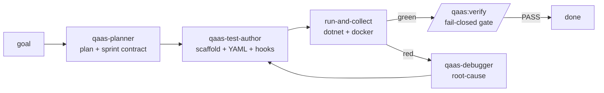

# QaaS Copilot — a Claude Code plugin for QaaS testing

A **native Claude Code plugin** that lets any model — including a *weak* local one (target:
MiniMax M2.7, 128k context) — do everything there is to do with
[QaaS](https://docs.qaas.online/): plan tests, write Runner/Mocker YAML, author custom C#
hooks, run and debug tests, diagnose failures, and build custom mocker Docker images — using
**only the QaaS docs and the NuGet packages** (no internet, no source code).

Every QaaS fact in this plugin was **verified by actually running QaaS** (real NuGets, real
Docker brokers, real green/red runs), not just read from docs. Where the docs are wrong, the
bundled Fact Base says so explicitly — **19 documented doc-drift traps**.

> **One knob.** The only thing you configure for a new environment is `QAAS_DOCS_URL`.
> Everything else — 20 skills, 4 subagents, 5 commands, the full offline Fact Base — ships
> inside the plugin.

---

## Install (pick one)

```
# A. Zero commands — open THIS repo in Claude Code; .claude/settings.json auto-enables it.

# B. One command — connected machine, inside Claude Code:
/plugin marketplace add eldarush/qaas-copilot
/plugin install qaas@qaas-copilot

# C. Airgapped — copy the repo to the host, then:
/plugin marketplace add /opt/qaas-copilot
/plugin install qaas@qaas-copilot
export QAAS_DOCS_URL="http://docs.internal.example.com"   # your mirror; the one knob
```

Full walkthrough, verification, and update/uninstall: **[INSTALL.md](./INSTALL.md)**.

---

## What you get

| Surface | What it does |
|---|---|
| **Auto-loaded expertise** | `qaas-overview` skill loads each session: constitution, the 19 drift traps, and the skill index |
| **19 task skills** | model-invoked by description (see table below) |
| **4 subagents** | `qaas-planner` (plan + contract), `qaas-test-author` (implement + verify), `qaas-debugger` (root-cause), `qaas-analyst` (read-only SUT/chart/test analysis) |
| `/qaas:docs <path>` | fetch a live docs page over **curl** from `$QAAS_DOCS_URL` (airgap-safe, no WebFetch) |
| `/qaas:fact <slice>` | print an offline Fact Base slice `s00`–`s15` — no network |
| `/qaas:new-test <goal>` | full plan → author → run → verify workflow |
| `/qaas:diagnose <evidence>` | triage a failing run from logs / exit codes |
| `/qaas:verify` | fail-closed completion gate before claiming "done" |

### The 19 task skills

| Skill | Does |
|---|---|
| `plan-test-sprint` | goal → validated, priority-ordered, verifiable task plan |
| `scaffold-runner-project` | runner csproj + NuGet.config + CopyToOutputDirectory |
| `scaffold-mocker-project` | mocker csproj (+ the `aspnet:10.0` Dockerfile fix) — MOCK_REQUIRED: yes only |
| `author-runner-yaml` | `*.qaas.yaml` — sessions, datasources, assertions, storages |
| `author-mocker-yaml` | `*.mocker.yaml` — servers, stubs, processors, controller |
| `choose-action-type` | intent → Transaction/Publisher/Consumer/Probe/MockerCommands |
| `pick-generator` | the 11 generators w/ exact config keys |
| `pick-assertion` | the 11 assertions w/ exact keys + vacuous-pass guard |
| `author-custom-hook` | C# IGenerator/IAssertion/IProbe/IProcessor hooks |
| `run-and-collect` | run/act/assert/template verbs, flags, allure artifacts |
| `diagnose-failure` | exit-code + error-signature triage table → fix |
| `build-mocker-image` | custom mocker Docker images (multi-stage, aspnet base) |
| `offline-packaging` | Artifactory feeds, NuGet.config, template install offline |
| `verify-done` | fail-closed completion gate before claiming ready |
| `validate-compatibility` | verify every QaaS field/version against Fact Base; reject deprecated drift-left-column forms |
| `analyze-sut-repo` | extract endpoints, schemas, env config, and transformation contracts from SUT source repos |
| `analyze-helm-k8s` | derive effective runtime config from Helm charts / K8s manifests with full values-layer resolution |
| `analyze-existing-tests` | inventory existing tests and produce a coverage-gap diff against the SUT surface catalog |
| `document-test-project` | produce a structured README for a finished QaaS test project |

Plus `qaas-overview`, the always-on master skill. Each `SKILL.md` carries a `contract:` block
— done-rubric, failure modes (citing Fact Base drift rows), and escalation codes.

---

## How a model uses it (the loop)



Design rules baked into the skills and agents (from QaaS learning-day notes + long-run agent
research):

- **Plan → generate → evaluate are separate contexts** — the evaluator assumes bugs exist.
- **"Done" is contracted before work starts** — every task ships mechanical `verify[]` +
  graded `rubric`.
- **Docs-or-silence** — never invent a field name, config key, or default; cite the Fact Base
  (`/qaas:fact`) or live docs (`/qaas:docs`), else stop and ask.
- **Guarded assertions** — `HttpStatus` passes vacuously on zero outputs, so every session
  assertion carries a hermetic count guard.

---

## Why trust it

- Fact Base facts carry `(FB sNN)` / `(LAB LN)` provenance. Lab runs L1–L8 cover: RabbitMQ
  end-to-end (green AND red), HTTP + mocker, custom hooks compiled & discovered, controller
  stub-swap over Redis, variables/cases/`-w`/`-c`, container mocker images, NuGet `%VAR%`
  expansion.
- `factbase/s13-doc-drift.md` lists every place the official docs are wrong, with the observed
  error and the verified fix (e.g. `ProcessorConfiguration` not `TransactionData`,
  `aspnet:10.0` not `runtime:10.0`, `StatusCode`+`OutputNames` not `ExpectedStatus`, the
  `HttpStatus` zero-output vacuous pass).
- The plugin is exercised end-to-end by a weak generator (gpt-5-mini, simulating MiniMax)
  judged by strong evaluators (Claude / Gemini), including the fail → feedback → iterate path.
  The eval corpus holds **57 scenarios across all 8 capability categories**; trials run them for
  real (dotnet + Docker + live NuGets). **All 57 scenarios pass end-to-end — every one of the 8
  categories is fully proven** (diagnose 6/6, runner-yaml 10/10, mocker-yaml 8/8, hooks 8/8,
  docker-image 6/6, offline 6/6, planning 6/6, analysis 7/7). The honest, current pass
  matrix lives in [eval/TRIAL-RESULTS.md](./eval/TRIAL-RESULTS.md). See also `eval/` and
  [AIRGAP.md](./AIRGAP.md).

---

## Repository layout

```
├── INSTALL.md             # one-button native install (start here)
├── AIRGAP.md              # offline runbook: NuGet feed, base images, local-model gateway
├── CLAUDE.md              # in-repo guide for working ON this platform
├── .claude/settings.json  # zero-command auto-enable of the plugin
├── .claude-plugin/        # marketplace.json (the catalog)
├── plugins/qaas/          # THE PRODUCT — the Claude Code plugin (self-contained)
│   ├── .claude-plugin/plugin.json
│   ├── skills/            # 20 skills (19 task + qaas-overview master)
│   ├── agents/            # 4 subagents
│   ├── commands/          # 5 slash commands
│   ├── hooks/hooks.json   # SessionStart: inject the master guide
│   └── factbase/          # s00–s16 offline, drift-corrected QaaS knowledge
├── platform/              # MAINTAINER-ONLY eval harness (constitution, factbase source, skills source, PowerShell drivers)
└── eval/                  # MAINTAINER-ONLY 50-scenario evaluation corpus + infra
```

**End users only need the plugin.** `platform/` and `eval/` are how the plugin was built and
proven — they are not required to use it. The plugin under `plugins/qaas/` is a self-contained
copy (skills + Fact Base) so it works when Claude Code copies it into its plugin cache.

---

## Maintainer / evaluation harness

`platform/` and `eval/` hold the PowerShell harness that drives the
plan → contract → generate → evaluate loop with real models and grades the output against the
50-scenario corpus. This is how the plugin is regression-tested before shipping. See
[AIRGAP.md](./AIRGAP.md) §5 and `platform/PROTOCOL.md`. End users can ignore it.
