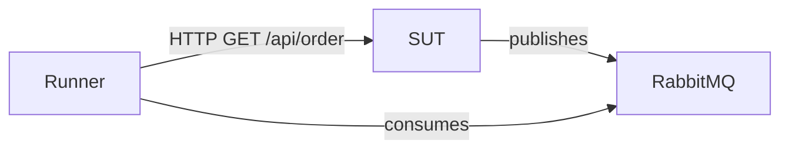

## When to use

Call after all test YAML and C# hooks are authored and verified green. Read the project
YAML files to produce an accurate README — do not invent content.

## Steps

### 1. Read the project files

Read all `*.qaas.yaml` and `*.mocker.yaml` files in the project. If `sut-profile.md` is
available, read its `## Protocols` and `## Topology` sections.

### 2. Produce README.md with these exact sections

#### `## What is tested`

One paragraph: the SUT component(s), protocol(s), and observable behavior the tests verify.
Every claim cites the YAML or sut-profile.md.

#### `## Topology`

Mermaid diagram (when relationships are clear) or a bullet list of components.
Example:



#### `## How to run`

Exact commands (FB s06):

```bash
# Build
dotnet build -c Release

# Verify YAML template
dotnet run -- template <file>.qaas.yaml

# Live run (start mocker first if MOCK_REQUIRED: yes)
dotnet run -- run <file>.qaas.yaml
```

#### `## Data sources`

Table of data source names, generator types, and file paths. Cite YAML line for each.

#### `## Assertions`

Table: `| Assertion name | Type | What it verifies |`. Note the hermetic guard present
(FB s13#13 — HttpStatus passes vacuously without it).

#### `## Troubleshooting`

- Run `/qaas:diagnose <evidence>` with the failing run output.
- Read FB s07 for the error-signature triage table and allure artifact layout.
- Common issues: missing PackageReference (FB s13#8), wrong Route (FB s13#5),
  vacuous pass (FB s13#13).

### 3. Validate before emitting

- Every CLI command matches FB s06 (no invented verbs or flags)
- Every QaaS field name has a `(FB sNN)` or `(docs/...)` citation
- No `TODO` or placeholder content

## Citations

- FB s06 (CLI verbs: build, template, run, act, assert)
- FB s07 (diagnosis artifacts, error table)
- FB s02 (runner YAML structure, session types)
- FB s13#8, s13#13 (PackageReference, vacuous pass)

## Traps

- **Invented CLI flags** — only use verbs/flags documented in FB s06
- **Missing ## Troubleshooting** — required section; point to `/qaas:diagnose` and FB s07
- **Mermaid without basis** — only draw topology if sut-profile.md or YAML provides the data
- **Uncited field names** — every `*.Configuration` key in the README needs a FB/docs cite
